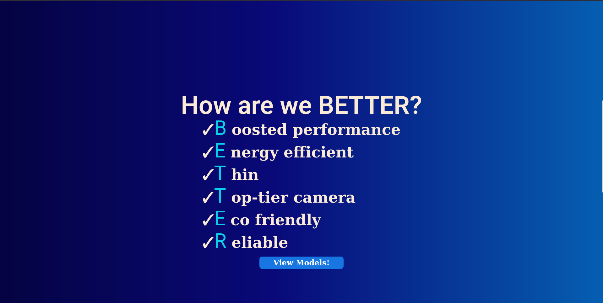

# Better Phone - Landing Page
This laboratory work is a landing page designed using pure html & css, inspired by other phone manufacturer's webpages for their newly launched products (i.e., Samsung, Apple).

## Sections
* Hero page - a basic introductory section to the product, along with a call to action quote, which should entice the customer to view the rest of the page.
* Features - a page which iterates the value proposition of our product, along with a button which redirects the customer to the products section.
* Our models - the part of the webpage where the customer is able to view/buy products.
* Contact us - information about how people could get in contact with us.

## Screenshots

### Hero page

### Features

### Models

### Footer

## Demo:

Visit the website on Github Pages - [Demo Link](https://lucian-lu.github.io/Web-Programming-Labs/)